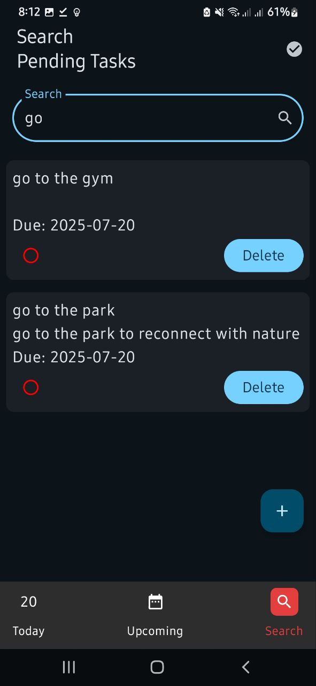
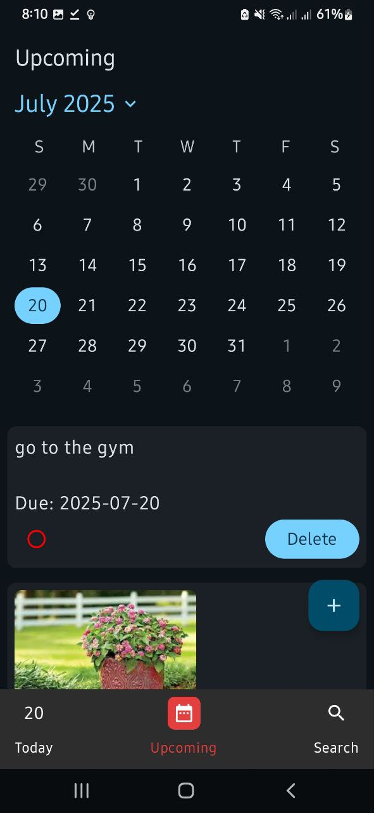
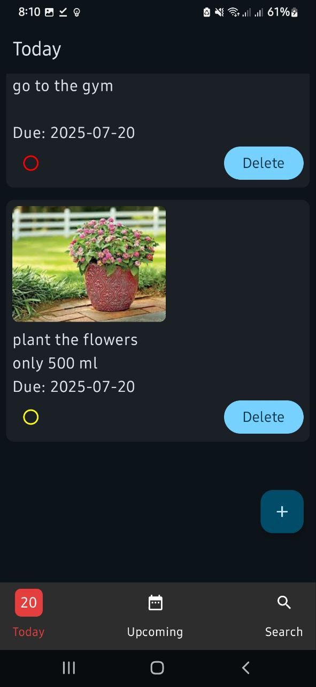
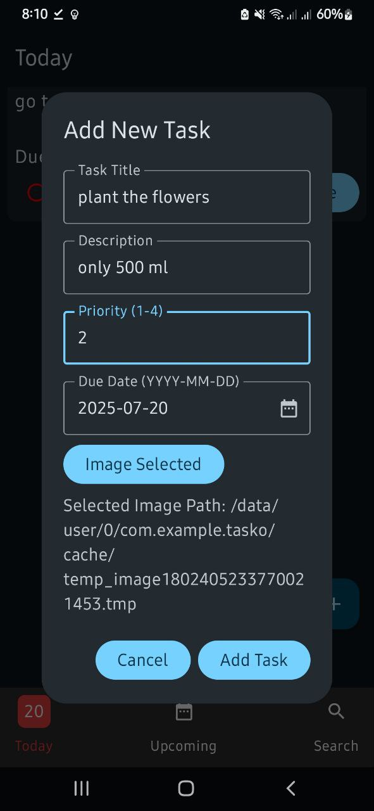

Tasko – Effortless Task Management for Everyday Productivity
A modern Android app to organize, prioritize, and track your daily and upcoming tasks with a beautiful, intuitive interface.

📝 Description
Tasko is a productivity-focused Android application designed to help users efficiently manage their daily and upcoming tasks.

With a clean, modern UI built using Jetpack Compose, Tasko enables users to:

Add, update, search, and organize tasks by priority and due date

Store tasks locally using a Room database for offline access

Toggle between pending and completed tasks

Attach images

Use a swipeable calendar to plan ahead

Tasko is ideal for anyone seeking a robust, real-world task management solution on Android.

🔄 User Flow
Launch the app to view today's tasks.

Add new tasks with title, description, priority, due date, and optional image.

Switch between "Today", "Upcoming", and "Search" views using the bottom navigation bar.

Use the calendar to browse and manage tasks for any date.

Mark tasks as completed, update, or delete them as needed.

Search tasks by title or description for quick access.

✨ Features
📅 Today & Upcoming Views: Easily switch between tasks due today and those scheduled for the future.

🗂 Task CRUD: Add, update, and delete tasks with support for title, description, priority (1–4), due date, and image attachment.

🔍 Search: Instantly filter tasks by title or description.

🏷 Priority Management: Assign and visually distinguish tasks by priority level.

✅ Mark as Completed: Toggle tasks between pending and completed states.

🗓 Swipeable Calendar: Select any date to view and manage tasks for that day.

🖼 Image Attachments: Add images to tasks for richer context.

🌙 Dark & Light Theme: Seamless support for system dark/light mode.

🏃 Offline-First: All data is stored locally using Room, ensuring full offline functionality.

🧩 Modern MVVM Architecture: Clean separation of concerns for maintainability and scalability.

📸 Screenshots

🛠 Tech Stack
Language: Kotlin

UI Framework: Jetpack Compose (Material 3)

Architecture: MVVM (Model-View-ViewModel)

Persistence: Room Database (with migration support)

Image Loading: Coil

Coroutines: For async and reactive flows

Dependency Injection: (Manual, via ViewModelFactory)

Testing: JUnit, AndroidX Test

Other: Modern Android SDK, Compose Navigation, Material Icons

🎯 What I Learned / Key Challenges Solved
Building Tasko deepened my expertise in modern Android development, especially with Jetpack Compose and MVVM architecture.

Key accomplishments:

Implemented a robust offline-first data layer using Room, with schema migrations and reactive flows

Designed a swipeable calendar and dynamic UI using advanced state management and custom composables

Solved challenges around image handling, efficient search/filtering, and delivering a seamless UX across dark and light modes

This project reflects my ability to deliver production-quality, maintainable code and an intuitive UX in a real-world mobile application.
